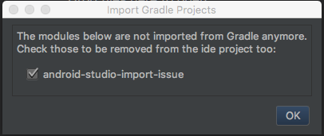

# android-studio-import-issue
This ia the smallest example that allows reproducing the issue @RobLewis found in RxAndroidBLE (https://github.com/Polidea/RxAndroidBle/issues/328)

#### Steps to reproduce actual result
1. In the "Welcome to Android Studio" window, select "check out project from Version Control", selecting GitHub
2. For the Git Repository URL, use (git@github.com:uKL/android-studio-import-issue.git) (Test button reports success) 
3. Click "Clone" and select "Yes" to creating a studio project 
4. In the "Import Project" window, leave "Import project from external model" selected, and leave the first "Gradle" selected in the window (there are 2 identical listings for "Gradle") 
5. Click "Next", and in the next window, leave the recommended "Use default Gradle wrapper" selected; click "Finish" 
6. Android Studio starts creating a project

  

#### Issue

The issue is related to a `rootProject.name = 'testproject-parent'` that is present in `settings.gradle`. It looks like AS is trying to import it by the folder name first and then switch to the one configured in gradle.
